# 使用YOLO模型

**前言**
> - 20260301：一开始是想在本电脑上部署相关的YOLO模型，来做一些图像识别的东西，但我对YOLO模型的认知还是停留在版本不断更新的这么一个粗浅状态，通过查阅了相关的资料发现不同版本的YOLO其实是有区别的，了解到v8版本虽属于六边形战士，但其实不必专门的追求v8版本，反而应该根据自己的需求来挑选对应的版本，首先对YOLO模型做一个全面的粗浅了解，然后首先部署能进行卫星图像（或无人机图像）处理的YOLO模型版本，这是跟我的自立课题实际相关的，需要完全掌握该版本的性能，原理等所有知识。
> - 在思考这些的同时，我发现我的电脑文件之间并不互通，比如硬件资料和计算机语言的一些资料总需要使用传统的手段传来传去，导致不能随时查看所有的学习文件，紧跟先前的学习思路和流程。为此，需要一个手段来打通信息的断联化存储，第一个想到的是使用github仓库。其实更安全的是使用一个云端设备来存储这些私有的资料，让学习连续可追溯，目前先使用github；这里也引出了随着世界的发展，云的重要性，同时跟我另一个想法的解决方案也很吻合，即智能机器人其实无需将脑子（CPU，GPU），也就是提供思考能力的功能带在身上，机器人只需带上“行动决策权”，脑子完全可放在外部，然后使用无线连接。

### 一 YOLO模型版本释义

1. YOLO版本谱
YOLO的演进主要沿着两条线展开：**学术创新线**和**工程实践线**。学术创新线由来自不同的研究机构推动，每次的更新往往伴随着原理上的重大突破，工程实践线主要由Ultrlytics公司维护，更侧重打造一个易用、稳定、功能丰富的工具库。下表是一些主流的版本：

|版本|发布时间|核心贡献/特点|所属主线|主要贡献者/机构|
|---|---|---|---|---|
|YOLOv1|2015年|开山之作。开创性地将目标检测视为回归问题，单次推理完成定位与分类，实现实时检测。|学术线|Joseph Redmon等
|YOLOv2	|2017年|引入锚框（Anchor Boxes）、批归一化和高分辨率分类器，大幅提升召回率与精度。|学术线	|Joseph Redmon等
YOLOv3|	2018年|采用Darknet-53骨干网络和特征金字塔（FPN）进行多尺度预测，显著提升了对小目标的检测能力。|学术线|Joseph Redmon等
YOLOv4|	2020年|	集大成者。整合了CSPNet、PANet、Mosaic数据增强等当年最先进的技巧，在精度和速度上取得卓越平衡。|学术线|Alexey Bochkovskiy等
YOLOv5|	2020年|	工程化标杆。由Ultralytics发布，提供模块化设计和多型号版本（n/s/m/l/x），训练和部署流程极简，迅速成为工业界首选。|工程线|Ultralytics (Glenn Jocher)
PP-YOLO	|2020年|百度基于PaddlePaddle框架实现的优化版本，在不增加推理时间的前提下，通过一系列技巧提升精度。|	衍生变体|百度
Scaled-YOLOv4|2020年|	基于YOLOv4，提出模型缩放方法，可以灵活地调整模型大小以适应不同硬件。|学术线|Chien-Yao Wang等
PP-YOLOv2|2021年|在PP-YOLO基础上进一步优化，引入了可变形卷积等模块，精度再次提升。|衍生变体|百度
YOLOR|2021年|提出了一种新颖的观点，让网络在学习识别任务的同时，也能学到通用的知识表示，从而提升泛化能力。|学术线|Chien-Yao Wang等
YOLOX|2021年|将YOLO检测器转变为无锚框（Anchor-free） 风格，并引入解耦头等先进结构，实现了性能的大幅跃升。|学术线|旷视科技
YOLOv6|2022年|工业级优化。美团团队开发，针对工业部署场景，在推理速度上做了极致优化（如RepVGG结构）。|工程线	|美团
YOLOv7|2022年|当时的精度巅峰。在实时性前提下，达到了顶尖的检测精度，并提出了E-ELAN等高效的网络结构。|学术线	|Chien-Yao Wang等
YOLOv8|2023年|统一框架。由Ultralytics在v5基础上全面升级，支持目标检测、实例分割、姿态估计等多任务。使用更简单、速度更快、精度更高，是生态最成熟的版本。	工程线|Ultralytics
YOLO-NAS|2023年|利用神经架构搜索（NAS） 技术自动搜索出的最优结构，在精度和延迟上超越了当时的许多手工设计模型。|衍生变体|Deci AI
YOLOv9|2024年|提出PGI（可编程梯度信息） 和GELAN架构，解决了深度网络中的信息丢失问题，在通用检测任务上精度领先。|学术线|Chien-Yao Wang等
YOLO-World|2024年|开集检测/零样本模型。你可以直接输入文字提示（prompt）来检测图像中的物体，无需再训练。|衍生变体|腾讯AI Lab
YOLOv10|2024年|端到端部署。提出一致双标签分配策略，彻底移除NMS（非极大值抑制） 后处理步骤，进一步降低推理延时。|学术线|清华大学
YOLOv11|2024年|工程优化新章。Ultralytics在v8基础上优化骨干网络和训练流程，能以更少的参数量获得更高的精度，效率更高。|工程线|Ultralytics
YOLOv12|2025年|注意力机制。架构上大胆创新，引入区域注意力机制，追求更高的理论精度，但速度和内存占用上有所牺牲。|学术线|学术界（社区驱动）
Gold-YOLO|2025年|提出了一种新的“聚集-分发”机制，增强了网络在多尺度上的特征融合能力，有效提升了目标检测性能。|衍生变体|华为诺亚方舟实验室
YOLOv26|2026年|边缘计算利器。采用原生的端到端架构（完全移除NMS），推理速度极快（CPU提升43%），并对小目标检测做了特别优化。|工程线|Ultralytics

除了这些版本，其实还有很多的衍生版本，比如阿里的DAMO-YOLO等，其在特定领域取得了不错成果。那么其实我学会这个之后，也可以针对我具体的任务来专门做一个自有版本，用于处理特定场景的应用。

学术线更像是一种概念车，其在探索深度学习的边界，为其引入全新的理论，比如注意力机制、可编程机制，是推动YOLO内在进化的源动力。工程线则像是家用车，追求的是稳定性、易用性和多任务支持，这也是v8版本至今仍是许多用户首选的原因。衍生变体则是各公司基于YOLO架构，针对特定目标（如零样本检测，神经架构搜索）进行二次创新的产物。这个就是我完全掌握YOLO后可以根据自己的需要来研究和开发的方向。

2. 版本总体理解
- v8版本：v8是的特点是：生态成熟，稳定可靠。其在某个极端指标上或许不是最佳，但是经过全球开发者的验证和使用，拥有海量的文档、教程和社区支持；上手即用，体验最佳，延续了Ultralytics家族`pip install ultralytics`极简安装注意，让目标检测、分割、姿态估计等复杂任务变得无比简单，这种开发者体验是学术版本短期难以超越的；场景覆盖广，泛化能力强，服务器到移动端，检测到姿态识别，开箱即用，且表现不输一些新版本。因此，对于选取YOLOv8，选择的是一种“确定性”和“通用性”。但是呢，对于具体的任务，我不追求全方位的稳定性，而是只专注于某一方面；目前专注的是卫星图像与野生动物识别。

- v9、v11和v26
v9有着最稳定的精度，其提出的PGI（可编程梯度信息）和GELAN架构旨在解决深度网络总的信息丢失问题，这让其拥有更强的特征学习能力，从而在通用检测任务上达到机制的精度，所需的代价是对算力有一定的要求。
v11和v26是ultralytics工程线的最新代表作，在特定的场景中具备巅峰精度。其中的v11是实例分割和复杂背景的王者，比如YOLOv11-SEG模型在车辆检测与分割任务中，其检测框的mAP50高达97.4%，展现出极强的定位精度。同时，在复杂背景中，比如农业领域YOLOv11x在复杂自然背景下对水果进行检测，其严格的mAP50-95指标达到了惊人的0.973，表明其在排除背景干扰、精准识别目标方面表现卓越。
v26则是小目标与端到端精度的后起之秀。，其引入了STAL（小目标感知标签分配），专门优化了小目标的检测能力。

3. 版本选择

对于卫星图像，是需要追求极致的精度，首选便是v9，其在遥感图像的多个权威评测中精度领先，抗干扰最强，如果检测小目标则可以重点尝试v26或者优化后的v11。那么对于我项目的无人机影像，其实可以结合两种方式，对于植物使用v9检测，比如竹子，重点植物，水源等对象；对于动物则使用v26。（提及到一篇文献，2025年发表于IEEE Access对于v1-v10版本的系统性测试，找出来看）

对于野生动物识别，追求的是高精度和鲁棒性，首选v11或其改进版，其展现了在复杂场景中极强的适应能力。总结如下表：

**卫星图像目标检测**
推荐模型|关键数据与场景|核心优势
|---|---|---|
YOLOv9|在DOTA遥感数据集上，YOLOv9-E 在多种图像干扰（噪声、模糊等）下的平均精度（mAP）超越其他模型，鲁棒性最佳 。在极高分辨率卫星图像飞机检测任务中，YOLOv9e 以更少的参数和计算量（比v8x低27%）达到了与v8x相当的精度 。|综合精度之王，抗干扰能力强，计算效率高。
YOLOv26|专门针对遥感图像设计，其端到端架构和小目标感知标签分配（STAL）机制，理论上能更好地处理图像中的小型地物（如车辆、船只） 。|小目标优化，端到端部署简化流程。
YOLOv11|在包含20类地物的高分辨率遥感图像测试中，YOLOv11 取得了 89.20% 的 mAP50 。通过增加小目标检测层和注意力机制优化后，小目标检测能力可进一步提升 。|工程实践优选，精度高且生态成熟。

**野生动物识别**

推荐模型|关键数据与场景|核心优势|
|---|---|---|
YOLOv11|在非洲野生动物数据集中，改进的 YOLOv11-WR 模型通过引入注意力机制和加权特征金字塔，mAP@50达到了 92.6%，尤其在检测斑马、羚羊等中小型动物时优势明显 。另一个研究也证实，结合CNN的YOLOv11框架能实现高效、准确的动物识别。|复杂场景精度高，对小动物和特征相似物种的区分能力强。
YOLOv10|在包含7类物种的相机陷阱图像数据集中，YOLOv10 以 95.6% 的精度和 67.5% 的mAP，超越了YOLOv8和v9。|特定数据集表现优异，在速度和精度间取得良好平衡。
YOLOv9 (或定制版)|针对澳大利亚50种动物的识别任务，基于 YOLOv9 改进的 YOLO-FCE 模型，取得了 87.5% 的mAP50:95 和高达 98.2% 的精度。|细粒度分类强，适合处理物种数量多、种间差异小的挑战。

那么，我先部署v9版本，它在遥感领域的通用精度和鲁棒性经过了多个研究的验证，是一个高且稳定的起点。其对项目中对极小目标（比如只有几个像素的物体）的检测要求极为苛刻，可以拿出一个测试集，单独对比 YOLOv26  的表现。


### 二 使用github创建专门的仓库进行资料上传管理 

上面就是今天对YOLO版本的一个极简梳理，接下来记录如何将以后的文件托管到github，以实现随时的访问。

我电脑下载好了Git BASH, Git GUI, Git CMD，同时我也有github账号。

1. 打开git bash，设置本地的连接，详情参照网页 [github连接教程](https://www.runoob.com/w3cnote/git-guide.html)。

2. 上传本地文件夹到仓库（推送本地仓库至git）
    
    - 首先需要在网页端登录github，并创建一个新的仓库，我命名的仓库名是"file_repo"
    - 然后上传本地文件，使用git bash命令端进行，代码如下演示：
    ```git
        cd D:\project\my-project           # 进入本地的工作目录，这里在进的时候可以使用/d/project/my-project方式直接进入

        git init                           # 初始化git仓库，其实就是初始化本地my-project文件夹，会生成一个.git文件

        git add .                          # 添加所有的文件

        git commit -m "first commit"       # 提交代码

        git remote add origin https://github.com/用户名/仓库名.git      # 绑定远程Github仓库

        git branch -M main
        git push -u origin main            # 将文件夹上传到github
    ```

3. 我在写上面第2点之前，已经完成了上传，因此，首次上传的文件其实没有包含`2.`之后的内容，现在我又新写了一些东西，再向其传一下。进行更新。使用的命令如下：
    ```git
        git add. 
        git commit -m "第二次提交"
        git branch -M main
        git push -u origin main
    ```

4. 我准备在该文件夹下再写一个README文件，并新建一个文件夹，里面放截图，一起上传至该仓库。
    首先建立文件夹images和README文本文件。如下图：
    

    然后对上述的新增进行上传，命令如下：
    ```
        git add . 
        git commit -m "第三次提交"
        git branch -M main
        git push -u origin main
    ```


### 三 部署YOLOv9_20260306

#### YAML补充


1. YAML（yet another markup language或YAML Ain't markup language）是一种轻量级数据序列化格式，常用来配置文件、数据交换、表示结构化数据。
配置文件：YAML广泛用于保存应用程序、服务、容器等的配置。
    
    - Docker Compose配置，如docker-compose.yml
    - Kubernets配置，如Pod，Service等
    - ML模型超参数设置
    - 如下示例：

        ```yaml
        server:
        host: localhost
        port: 8080
        database:
        user: admin
        password: none
        name: test_id
        ```

2. YAML数据序列化：可将复杂的数据结构序列化为字符串，便于传输或存储，然后再反序列化为程序中的数据；适合多层嵌套的字典、列表、字符串等数据；常用于替代JSON或XML，与JSON和XML类似，YAML也是一种数据格式，但更易于手写和阅读，可读性`YAML > JSON > XML`，YAML和JSON更适合配置，XML更适合文档与协议；YAML支持多种编程语言，如Python、Java、C++等。

3. YAML基本用法
    - 键值对，使用冒号风格键和值
    - 缩进表示层级，且使用的是空格不是Tab键
    - 列表，使用短横线表示列表项。如：
        ```yaml
        fruits:
          - apple
          - banana
          - orange
        ```
    - 嵌套结构，支持嵌套字典和列表。如
        ```yaml
        enviroment:
          dev:
            url: http://localhost: 8080
            debug: true
          prod:
            url: http://test.com
            debug: false
        ```
    - 多行字符串，使用`|`或`>`表示多行文本
    - 数据类型，支持字符串、数字、bool值、日期等

4. YAML优势与常用场景
易读性高，语法直观简单，适合人类编辑；简单灵活，支持复杂数据结构；使用广泛，被很多现代工具如：Docker，Kubernets用作标准配置文件格式。
典型的使用场景主要就是：Docker配置文件，Kubernetes配置文件，机器学习超参数设置。

    - Docker Compose文件：
        
    ```yaml
    version: "3.9"
      services:
        web:
          image: nginx
        ports:
          - "80:80"
      db:
        image: mysql
        environment:
          MYSQL_ROOT_PASSWORD: example
    ```

    - Kubernetes配置文件
    
    ```yaml
    apiVersion: v1
    kind: Pod
    metadata:
      name: test
    spec:
      containers:
        - name: nginx
          image: nginx:1.14.1
    ```

    - 机器学习超参数设置
    ```yaml

    model:
      type: bert
      hidden_size: 768
      num_layers: 12
    traing:
      batch_size: 32
      learning_rate:0.001
      epochs:10
    ```

#### 部署步骤-20230307

> 需要安装好anaconda3和pycharm

1. 下载
在[github YOLO v9](https://github.com/WongKinYiu/yolov9)页面找到`code`，下载里面的`.zip`文件。下载将得到`yolov9-main`文件；然后找到页面后面的`Performance`和`Evaluation`，这里面有提升精度的模型权重下载，虽然这个是非必须的，先下载下来。如下图：

<div align=center>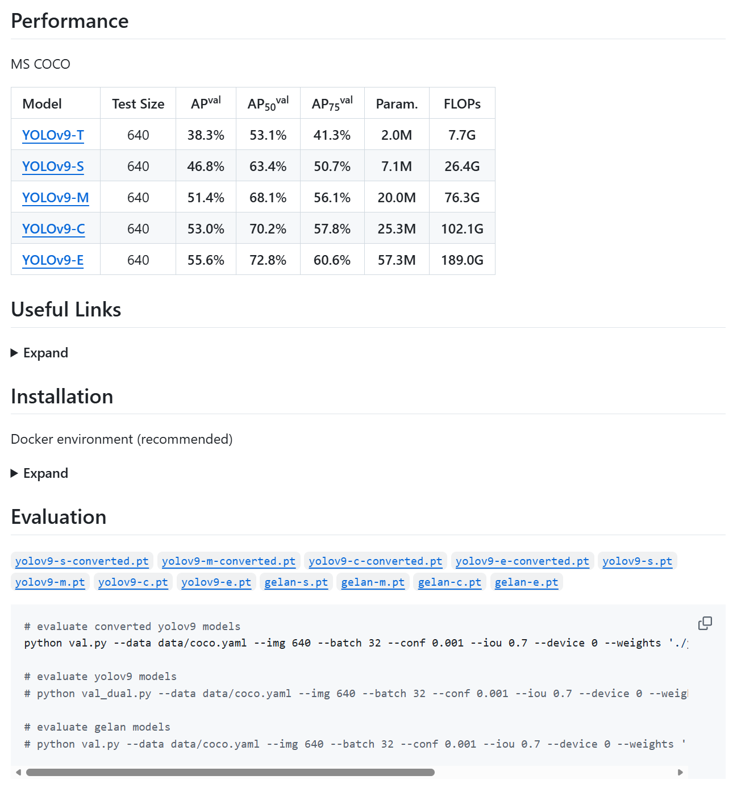</div>

这里面还有对应的`gelen-m,c,e`权重文件。这里相应的，也只是下载了`yolov9-c(m,e)-converted.pt`和`yolo-c(m,e).pt`文件,(converted：已转换)。这些文件都建议放在解压后的`yolov9-main`文件夹中`models`文件夹里。如下：

<div align=center>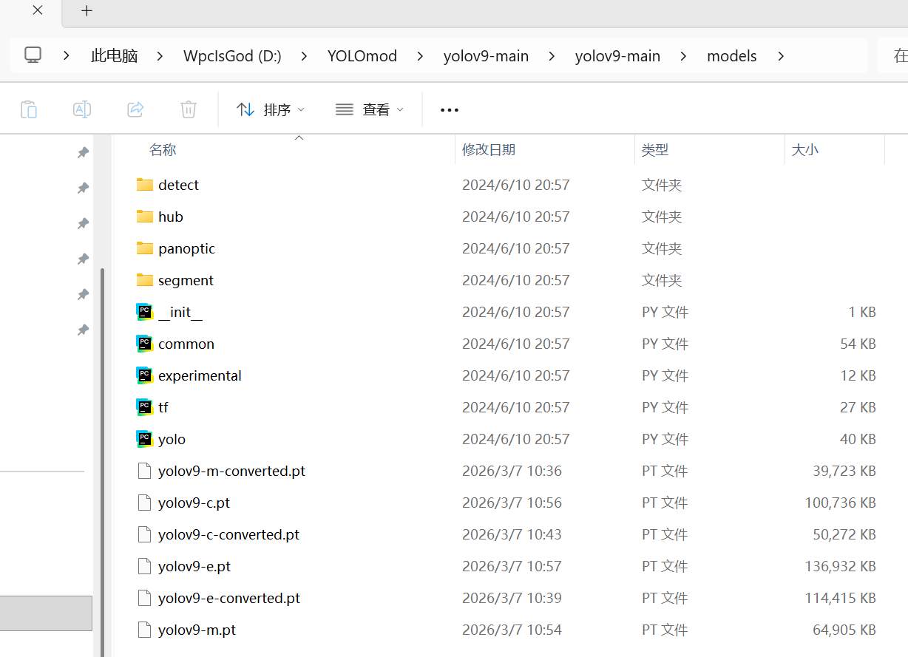</div>

2. 创建anaconda3虚拟环境、下载所需要依赖包

- 创建anaconda3的虚拟环境。
  - 进入对应文件夹。打开`Anaconda Prompt`,进入解压好的`yolov9-main`文件夹中。这里不知道为什么一直有个bug，或者说是逻辑错误？直接`cd`进不去文件夹，需要再输入一个`D:`，或者先输入一个`D:`，再cd进文件夹。
  <div align=center>
    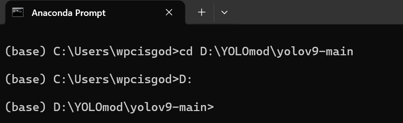
  </div>
  
  - 创建虚拟环境和启动虚拟环境。要求`python=3.8`，如下：
    ```
    conda create -n yolov9 python=3.8
    ```

    <div align=center>
      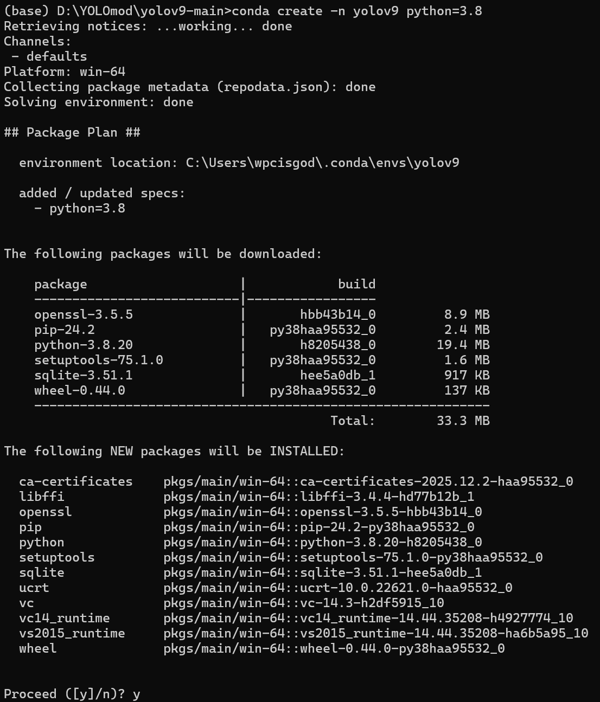
    </div>

  启动环境
    <div align=center>
      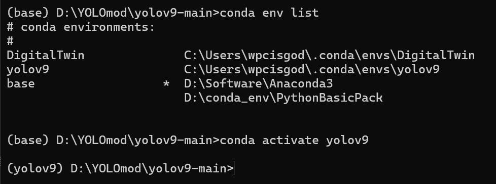
    </div>

- 在该环境安装依赖包
  安装时加清华端口
  ```
  pip install -r requirements.txt -i https://pypi.tuna.tsinghua.edu.cn/simple
  ```
  如图：
  <div align=center>
      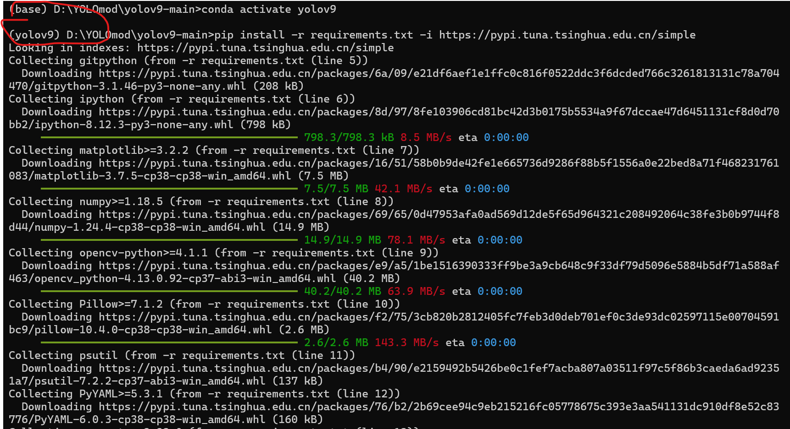
  </div>
  
也可以使用`pip list`查看该环境已安装的包，对应着`requirements.txt`中包的要求进行比对一下，看是否正确
  <div align=center>
      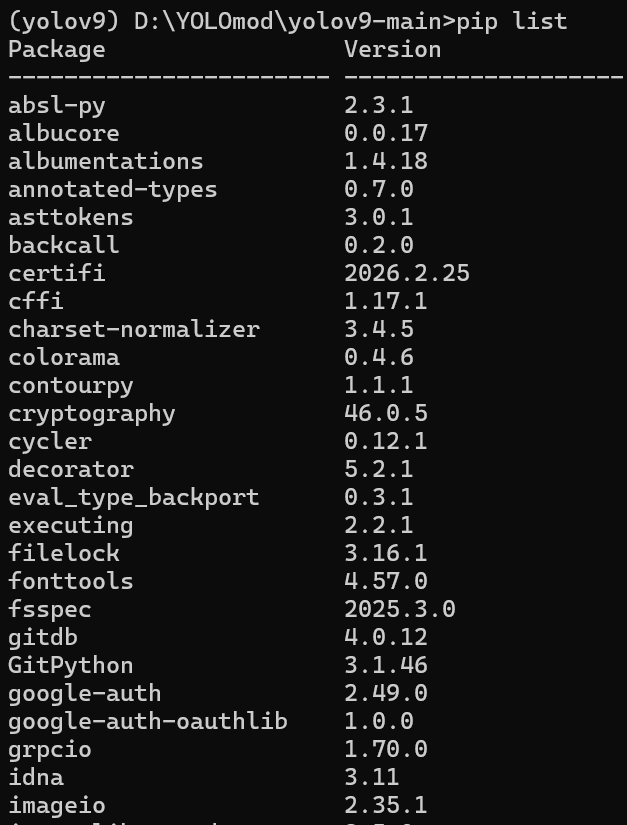
  </div>

不加端口
  ```
  pip install -r requirements.txt
  ```
3. 下载CUDA

- CUDA是连接GPU和模型训练的桥梁，对于图片处理，GPU的速度是CPU约10倍左右，且效果更好。将这个CUDA也安装到上面的虚拟环境中，这样以后使用YOLO的其他版本也不会冲突。查看本电脑cuda版本:cmd中输入`nvidia-smi.exe`,结果如下：

<div align=center>
  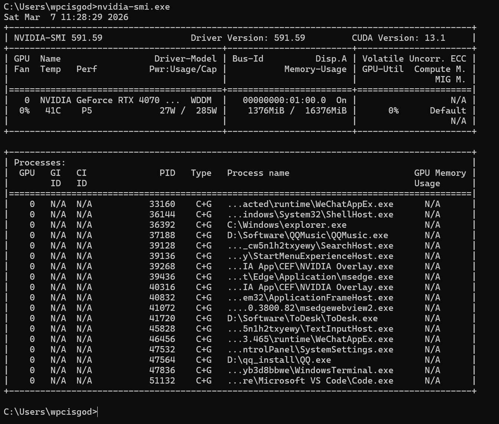
</div>


版本号是13.1，这里下载cuda版本可以低于这个值，但不能高，一般来讲，可以下载一个较低的版本，更加稳定，但如果电脑本身不是顶配，一般就这个版本，因为上面还有更高的版本，这个本身算是低版本的，好电脑才考虑的问题。

- 在创建的虚拟环境安装cuda

  在安装的时候，`requirements.txt`中要求的torch版本>=1.7.0,在上面使用该文本文件进行安装的时候，安装了一个torch=2.4的版本，然后使用`conda search cudatoolkit`查看该环境下可用cudatoolkits时，有如下的版本号：

  <div align=center>
  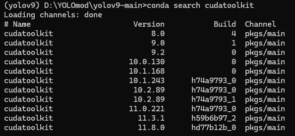
  </div>

  纠结了我一段时间，安装教程里面安装的cudatoolkits是11.0，对应的torch版本是1.7.1，[教程地址](https://irobotdeveloper.csdn.net/690daf0982fbe0098ca94781.html?spm=1001.2101.3001.6650.7&utm_medium=distribute.pc_relevant.none-task-blog-2~default~BlogCommendFromBaidu~activity-7-139443726-blog-136249119.235%5Ev43%5Epc_blog_bottom_relevance_base9&depth_1-utm_source=distribute.pc_relevant.none-task-blog-2~default~BlogCommendFromBaidu~activity-7-139443726-blog-136249119.235%5Ev43%5Epc_blog_bottom_relevance_base9&utm_relevant_index=13)，那我现在要改一下版本，根据上面“requirements.txt”默认装了一个2.4.1版本的torch，那我就装这个版本的torch，就要找到对应的cudatoolkit版本，并且最好就在这个版本就在上图conda支持的包目录下，这样就不用去专门找了。

  最终，**torch的2.4版本，能跟CUDA 11.8对应，那么最终确定的组合就是：CUDA 11.8；torch 2.4版本**，然后去找安装命令，[torch网址](https://pytorch.org/get-started/previous-versions/)上对应的命令如下：

  <div align=center>
  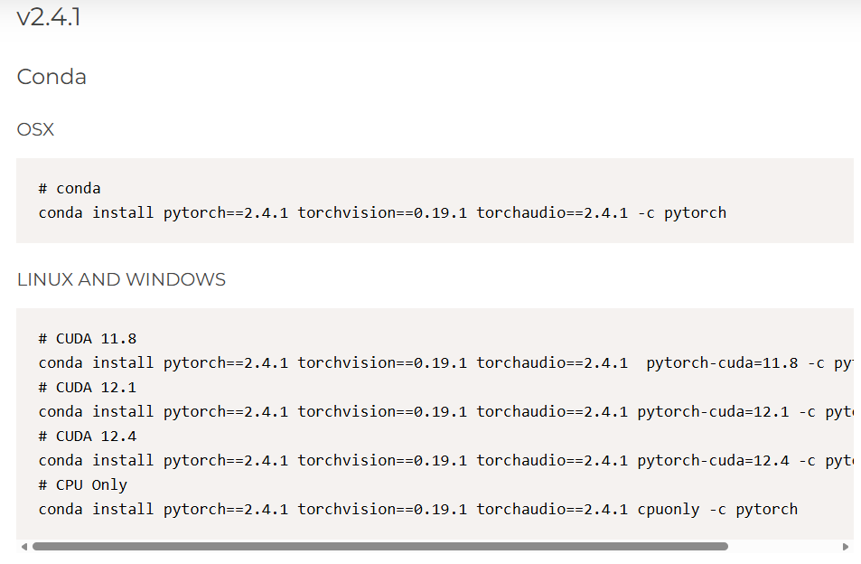
  </div>

  直接输入安装命令：

  ```
  conda install cudatoolkit=11.8
  ```
  
4. 下载pytorch
cuda和cuDNN是连接GPU和模型训练的桥梁（上面的那句话），pytorch是进入桥梁的那段上坡路。**<font color="red">pytorch库必须和cuda版本匹配，其实这个步骤应该是先看`requirements.txt`中的版本要求，然后看下自己电脑的CUDA版本号，再根据版本号找对应的pytorch版本。</font>**此外，在`requirements.txt`中要求的是`torch>=1.7.0`，这个就是pytorch的要求版本。
在安装的时候，又看见了一个cudnn，这个其实也是要装的吗？使用命令：

    ```
    conda search cudnn
    ```
  
    可以查看支持的conda支持的cudnn版本，但是cudnn教程中并没有安装，教程中直接安装了cudatoolkit和对应的torch就收工了。那就先安装cuda 11.8版本对应的torch 2.4.1,命令就是上图中对应的那句：

    ```
    conda install pytorch==2.4.1 torchvision==0.19.1 torchaudio==2.4.1  pytorch-cuda=11.8 -c pytorch -c nvidia
    ```

    这个安装了很久，这里安装的就不是“requirements.txt”中的缩写torch了，而是全称的叫pytorch包，这个包1.38G，13:00开始的，到现在半小时才19%（应该使用镜像的，万一中途断了白整），先去煮个饭了，如下图：

    <div align=center>
    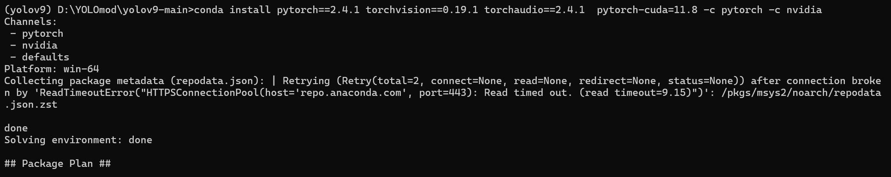
    </div>
  
    这个安装完了，就是配置pycharm进行版本检测，查看是否可用；然后进行数据制作，进行训练了，这个需要单独开一大章进行记录。

5. 版本检测和pycharm解释器配置

- 版本检测

  安装的时候，电脑休眠了，导致安装中断，重新输入`conda install pytorch==2.4.1 torchvision==0.19.1 torchaudio==2.4.1  pytorch-cuda=11.8 -c pytorch -c nvidia`命令后，会接着安装，并且速度变快了，这是为何？安装完成后，重启了一下电脑。重新进入该文件夹下，并启动yolo环境。然后在该文件夹`yolov9-main`中新建了一个`cuda_test.py`的文件，然后在命令行中运行，但是报错了，如下图：
  <div align=center>
    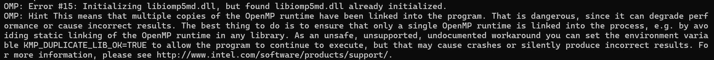
  </div>

  cuda_test.py的代码如下
  ```python
    import torch

    print('CUDA版本:',torch.version.cuda)
    print('Pytorch版本:',torch.__version__)
    print('显卡是否可用:','可用' if(torch.cuda.is_available()) else '不可用')
    print('显卡数量:',torch.cuda.device_count())
    print('当前显卡型号:',torch.cuda.get_device_name())
    print('当前显卡的CUDA算力:',torch.cuda.get_device_capability())
    print('当前显卡的总显存:',torch.cuda.get_device_properties(0).total_memory/1024/1024/1024,'GB')
    print('是否支持TensorCore:','支持' if (torch.cuda.get_device_properties(0).major >= 7) else '不支持')
    print('当前显卡的显存使用率:',torch.cuda.memory_allocated(0)/torch.cuda.get_device_properties(0).total_memory*100,'%')
  ```
  
  该错误表明在该虚拟环境中有多个`libiomp5md.dll`文件，找到虚拟环境，然后删一个即可。

  接着运行结果如下：
  <div align=center>
    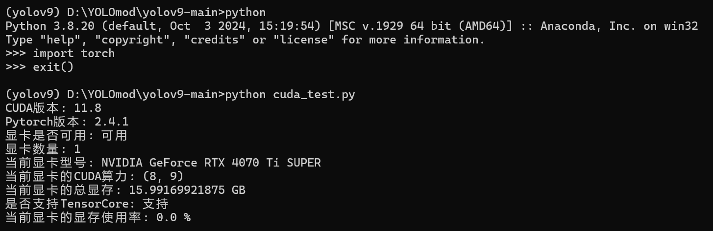
  </div>
  表明安装是正确的，到此环境就配置完成了。

- 配置pycharm的解释器
首先打开项目，即打开`./路径/yolov9-main`这个文件夹，然后在依次点击：文件-设置-添加解释器，找到新建的虚拟环境即可。在打开文件夹的时候，现在的pycharm要求选择是否信任该文件，信任即可。pycharm现在将视'yolov9-mian'为项目，就可以在这里面进行编辑，且会将改变存到对应的路径中去。如下：

<div align=center>
    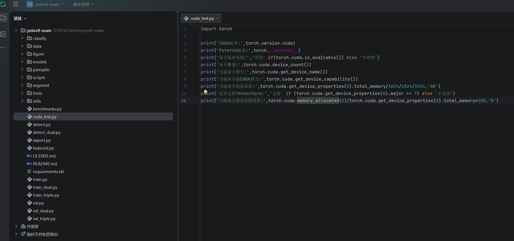
</div>
也可以运行刚才建的`cuda_test.py`，如下：
<div align=center>
    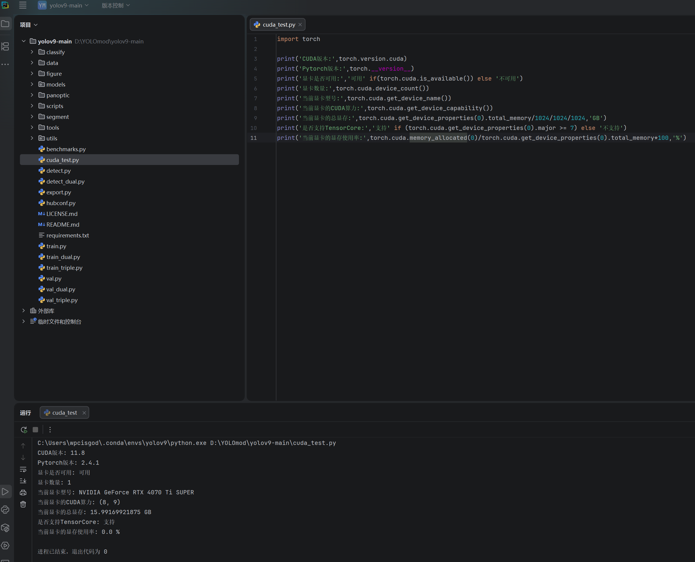
</div>

其运行结果是和命令行一致的。这里也就表明了，其实并非要pycharm来打开yolov9的，编辑好文件存到该文件夹下，在命令行直接运行也是没得问题，而且不需要通过pycharm，会快一点，pycharm的优势在于，有相应的语法提示和界面而已。

### 四 准备数据与模型训练

1. 通常在README文件中，使用文件树来清晰的表示文件夹的结构。这里演示一下怎么用，就拿本项目`yolov9-main`的文件夹来示例。直接是使用windows cmd自带命令tree生成的。下面的文件结构便是yolo训练时期望的文件格式。

```
Aerial-YOLO-DOTA/
├── src/
│   ├── dota.yaml                # 数据集配置文件，记录图片路径和类别
│   └── ...
├── datasets/                     # 处理后的数据集
│   ├── images/
│   │   ├── train/                # 切分后的训练图片（如 640x640）
│   │   └── val/                  # 切分后的验证图片
│   ├── labels/
│   │   ├── train/                # 对应的YOLO格式标签
│   │   └── val/
│   └── ...
```

2. COCO数据集和DOTA数据集参考网址
[COCO数据集中文介绍](https://blog.csdn.net/qq_37541097/article/details/113247318)，该文详细介绍了COCO数据集的内容。
[COCO数据集git详情](https://docs.ultralytics.com/zh/)
[COCO数据集官网](https://cocodataset.org/#home)，COCO数据集官网。
[DOTA数据集官网](https://captain-whu.github.io/DOTA/dataset.html)，DOTA数据集的官网。

- 2.1 **COCO数据集**

> **内容**
>
> - [ ] COCO数据集简介与下载
> - [ ] COCO标注文件格式
> - [ ] 验证目标检测任务mAP
  
**COCO 数据集简介**

COCO（Common Objects in Context），是一个大型通用图片数据集；包含了目标检测、分割、图像描述等。该数据集包含以下特点和内容：
  
  - Object segmentation: 目标级分割
  - Recognition in context: 图像情景识别
  - Superpixel stuff segmentation: 超像素分割
  - 330k images(>200k labels): 超33万张图像，标注超20万张图像
  - 1.5 million object instances: 150万个对象实例
  - 80 object categories: 80个目标类别
  - 91 stuff categories: 91个材料类别
  - 5 captions per images: 每张图像5段情景描述
  - 250000 people with keypoints: 对25万个人进行了关键点标注，比如眼睛，鼻子等。（这个对大熊猫来讲，也可以进行关键点标注）

注意点：①：“什么是stuff类别”：原文是：where "stuff" categories include materials and objects with no clear boundaries(sky,street,grass)。即：stuff特指那些没有明确的边界材料和对象，比如天空，街道，草坪这样的目标。
②：object中80个类别和stuff中的91类区别：简单讲是：80 object是91 stuff的子集。

**数据集下载**，可以直接在官网进行下载。以coco2017数据集为例，一般每个数据集由`xx Train images`, `xx Val images`, `Train/Val annotations`组成，其代表是分别是训练所使用的所有图像文件、验证所使用的所有图像、对应训练集和验证集的标注json文件。如下就是coco2017数据下载后解压得到的文件结构。

```
├── coco2017: 数据集根目录
     ├── train2017: 所有训练图像文件夹(118287张)
     ├── val2017: 所有验证图像文件夹(5000张)
     └── annotations: 对应标注文件夹
     		  ├── instances_train2017.json: 对应目标检测、分割任务的训练集标注文件
     		  ├── instances_val2017.json: 对应目标检测、分割任务的验证集标注文件
     		  ├── captions_train2017.json: 对应图像描述的训练集标注文件
     		  ├── captions_val2017.json: 对应图像描述的验证集标注文件
     		  ├── person_keypoints_train2017.json: 对应人体关键点检测的训练集标注文件
     		  └── person_keypoints_val2017.json: 对应人体关键点检测的验证集标注文件夹
```

值得注意的是。COCO数据集由于类别不平衡而存在固有偏差，当一类得样本数量与其他类中得样本数量有着显著得不同时，就会发生类不平衡，在COCO数据集上下文中，某些对象类比其他对象有更多得图像实例。类别不平很会导致机器学习模型得训练和评估出现偏差，即多的识别效果会好，而出现频率较低得则表现不佳。

**coco数据标注格式**
[COCO数据标注格式官网](https://cocodataset.org/#format-data)中有具体的要求。分别是`object detection，keypoint detection，stuff segmentation，panoptic segmentation，densepose，image captioning`这6种不同任务,每种任务有各自要求的格式化数据。

**COCO数据集详细分类-20260309**

**Object detection：目标对象检测**。目标对象检测是最流行得计算机视觉应用程序，其检测带有边框得对象，以实现他们在图像中的分类和定位，COCO数据集可用于此任务，得到目标检测模型，数据集为80种不同类型得物体(对象)的坐标提供了**边界框**，便于训练进行分类。简单来讲就是画框的图像进行模型训练。如下图：

**Instance segmentation：实例分割**。实例分割时计算机视觉的一种任务，涉及识别和分割图像中的多个对象，同时为对象的每个实例分配唯一标签。首先识别图像中对象的位置，然后模型使用语义分割技术(如CNN)对边界框中的对象进行分段，并为每个实例分配唯一标签。简单来讲就是将轮廓画出来，然后给标签。如下图：

**Semantic segmentation语义分割**。语义风格是一项计算机视觉任务，涉及将图像中的每个像素分类为几个预定义的类别之一，与实例分割不同，实例分割侧重于将每个对象实例识别和分割为图像中的单独实体。
但为了训练语义分割模型，需要将一个数据集，其中包含图像以及图像中每个类别相应的像素级注释，这些注释通常以掩码的形式提供，其中每个像素都有一个标签，指示器所属的类。简单的来讲：就是从像素级别将实例分割得到的轮廓将该区域像素分到类别。
**Keypoint detection 关键点检测**。也叫关键点估计，是一项计算机视觉任务，涉及识别图像中特定的兴趣点，例如人的关节，物体角点等，那么大熊猫其实特别适合使用这个，黑眼圈、肩带等。该方法常用于对象追踪、运动分析和人机交互。如下：

**Panoptic segmentation全景分割**。全景分割是一项计算机视觉任务，涉及识别和分割图像中所有对象和背景。其结合了实例分割和语义分割，实例分割用于分离对象，语义分割用于分割背景。
**Dense pose 密集姿势**。密集姿势是一项计算机视觉任务，用于估计图像中物体或人的3D姿势。
**Stuff image segmentation图像分割**。语义类可以分为事物（具有明确定义的形状，如人动物汽车）或东西（无定形背景区域，如天空，草等）。
一个很重要的数据集详细分类的网站[Ultralytics yolo26数据集文档](https://docs.ultralytics.com/zh/datasets/)。里面包含了包括COCO的等其他数据集。由于使用本模型主要进行的是遥感数据识别，为了给后面无人机测绘得到的图像进行自动化处理，为此就在此界面找了一个`VisDrone`
的无人机数据集。

- **2.3 VisDrone数据集**
VisDrone数据集是天津大学AISKTEYE团队创建的大规模基准，专为基于无人机图像和视频分析相关的各种计算机视觉任务而设计，主要内容包括：
    
    - 组成：288个视频片段，包含261908帧和10229张静态图像
    - 注释：超过260万个边界框，用于标注行人、汽车、自行车和三轮车等物体
    - 多样性：涉及14个城市、城市和乡村环境，不同光照条件下收集的数据
    - 任务：分为5个主要任务，图像和视频中的物体检测、单目标与多目标跟踪、人群计数。 

  VisDrone数据集的主要子集以及应用：
      **任务1：** 图像中的目标检测
      **任务2：** 视频中的目标检测
      **任务3：** 单目标跟踪
      **任务4：** 多目标跟踪
      **任务5：** 人群计数

   **VisDrone数据集下载_20260310。**已下载至本地，现在开始使用YOLOv9进行相关的训练。


- 2.4 **DOTA数据集**


### 五 开始模型训练20260310

VisDrone数据集分为了5个任务数据子集，如前述所描述，对应的存入本地分别命名为：`Task1, Task2, Task3, Task4, Task5`。现在以任务1：图像中的目标检测首先进行训练，Task1中的数据又被分为4个数据子集。文件结构如下：

```
Task1
├─VisDrone2019-DET-test-challenge
│  └─VisDrone2019-DET-test-challenge
│      └─images
├─VisDrone2019-DET-test-dev
│  ├─annotations
│  └─images
├─VisDrone2019-DET-train
│  └─VisDrone2019-DET-train
│      ├─annotations
│      └─images
└─VisDrone2019-DET-val
    └─VisDrone2019-DET-val
        ├─annotations
        └─images
```
点开所有的数据集进行大概的浏览，有一个直观的感受。

**1. 数据转换**
YOLOv9无法直接识别并处理VisDrone原始的数据标注格式，需要使用一个Python脚本，将标注信息转换成所需要的格式。在YOLOv9的项目奴目录下，创建一个`visdrone2yolov9.py`的文件，写入如下的转换代码。
``` python
import os
from pathlib import Path
from PIL import Image
from tqdm import tqdm

def visdrone2yolo(dir):
    # 创建 labels 文件夹
    (Path(dir) / 'labels').mkdir(parents=True, exist_ok=True)

    # 获取所有标注文件
    annot_files = sorted((Path(dir) / 'annotations').glob('*.txt'))
    pbar = tqdm(annot_files, desc=f'Converting {dir}')

    for f in pbar:
        # 获取对应的图片尺寸
        img_path = (Path(dir) / 'images' / f.name).with_suffix('.jpg')
        try:
            img_size = Image.open(img_path).size
        except FileNotFoundError:
            print(f"Warning: Image not found for {f.name}, skipping.")
            continue

        lines = []
        with open(f, 'r') as file:
            for row in [x.split(',') for x in file.read().strip().splitlines()]:
                # 跳过被标记为 'ignored regions' (类别0) 的目标
                if row[4] == '0':
                    continue
                # 获取类别ID (VisDrone原始ID从1开始，需要减1变成0-9)
                cls = int(row[5]) - 1
                # 获取边界框坐标 [x1, y1, w, h]
                bbox = list(map(int, row[:4]))
                # 转换为YOLO格式 [x_center, y_center, w, h] (均归一化)
                x_center = (bbox[0] + bbox[2] / 2) / img_size[0]
                y_center = (bbox[1] + bbox[3] / 2) / img_size[1]
                width = bbox[2] / img_size[0]
                height = bbox[3] / img_size[1]
                lines.append(f"{cls} {x_center:.6f} {y_center:.6f} {width:.6f} {height:.6f}\n")

        # 写入新的label文件
        label_path = Path(dir) / 'labels' / f.name
        with open(label_path, 'w') as fl:
            fl.writelines(lines)

# 配置：将下面的路径替换为你存放VisDrone数据集的**绝对路径**
dataset_root = '/home/user/data/VisDrone' # 请务必修改！

# 对训练、验证、测试集分别进行转换
for d in ['VisDrone2019-DET-train', 'VisDrone2019-DET-val', 'VisDrone2019-DET-test-dev']:
    visdrone2yolo(os.path.join(dataset_root, d))

print("转换完成！")
```

上述代码需要将`dataset_root`的路径改为本地电脑存放visdrone数据集的实际路径，运行该脚本后，会在每个数据集下生成一个labels文件夹，里面便是yolov9能识别的标签文件。此外下图是一些python的命名规范：
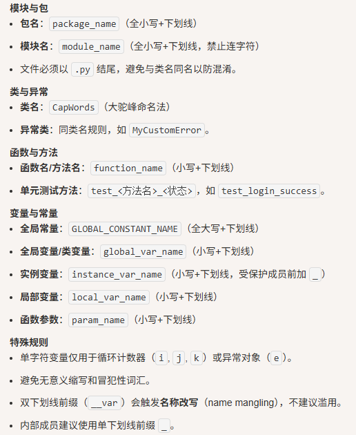

填写好路径后，可直接在pycharm中直接运行该脚本，运行结果如下：
<div align=center>
  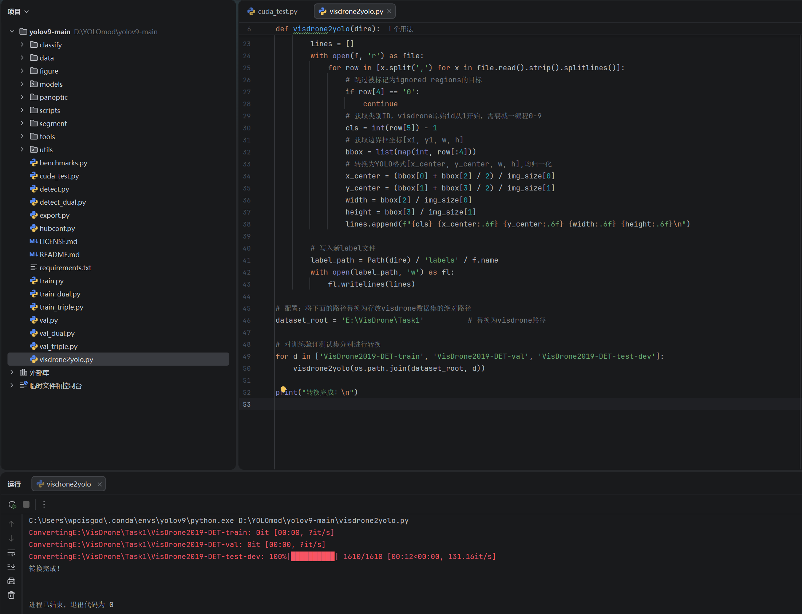
</div>

对应文件夹下产生的文件目录如下，可以看见多产生一个labels的文件，点看查看一下与annotations的对应关系：
```
├─VisDrone2019-DET-test-challenge
│  └─VisDrone2019-DET-test-challenge
│      └─images
├─VisDrone2019-DET-test-dev
│  ├─annotations
│  ├─images
│  └─labels
├─VisDrone2019-DET-train
│  ├─labels
│  └─VisDrone2019-DET-train
│      ├─annotations
│      └─images
└─VisDrone2019-DET-val
    ├─labels
    └─VisDrone2019-DET-val
        ├─annotations
        └─images
```

在运行转换的时候，产生了一点意外，只有VisDrone2019-DET-test-dev产生了labels文件夹，VisDrone2019-DET-train, VisDrone2019-DET-val产生的labels文件夹都是空的，原因在于上面这个文件夹结构的annotations文件夹不跟images在同一层级目录，为此重新建立一个文件夹，目录结构如下,这样的话，产生的labels才会不为空：
```
├─VisDrone2019-DET-test-dev
│  ├─annotations
│  ├─images
│  └─labels
├─VisDrone2019-DET-train
│  ├─annotations
│  ├─images
│  └─labels
└─VisDrone2019-DET-val
    ├─annotations
    ├─images
    └─labels
```

**2. YAML文件**
接下来创建导航文件`visdrone.yaml`配置文件，目的在于告诉YOLOv9去哪里找这些图片，以及数据中有哪些目标类别，该文件需要在YOLOv9项目文件夹下，与train.py同级。`visdrone.yaml`文件内容如下：
```yaml
# 数据集路径配置 (使用绝对路径)
path: /home/user/data/VisDrone  # 数据集的根目录
train: VisDrone2019-DET-train/images  # 训练图片路径（相对path）
val: VisDrone2019-DET-val/images      # 验证图片路径（相对path）
test: VisDrone2019-DET-test-dev/images # 测试图片路径（相对path）

# 类别配置
nc: 10  # 类别数量 (Number of Classes)
names: ['pedestrian', 'people', 'bicycle', 'car', 'van', 'truck', 'tricycle', 'awning-tricycle', 'bus', 'motor']
```

**3. 开始训练**

YOLOv9部署好的环境中有`train_dual.py`的python文件，其原始内容如下：
```python
略，太长了
```
但deepseek给出的`visdrone.yaml`文件内容是：
```bash
python train_dual.py \
  --batch 16 \                         # 根据你的GPU显存调整，越大越好，但别超显存
  --epochs 100 \                        # 训练轮数，100轮是比较稳妥的起点
  --img 640 \                            # 输入图片尺寸，VisDrone原图很大，训练时会自动缩放
  --device 0 \                            # 使用哪块GPU，0代表第一块
  --data ./visdrone.yaml \               # 指向我们刚创建的配置文件
  --weights ./gelan-c.pt \                # 预训练权重，用官方提供的gelan-c.pt效果较好
  --cfg ./models/detect/gelan-c.yaml \   # 模型配置文件，要和权重对应
  --hyp ./data/hyps/hyp.scratch-high.yaml \ # 超参数配置，一般保持默认
  --name visdrone_exp \                    # 本次实验的名称，输出会保存在runs/train/visdrone_exp
  --close-mosaic 15                         # 技巧：最后15个epoch关闭Mosaic数据增强，让模型更稳定
```

- --batch：这是最影响显存的参数。可以先从16试起，如果显存溢出（OOM）就减小到8或4。
- --weights 和 --cfg：务必保证它们是一一对应的。用 gelan-c.pt 就配 gelan-c.yaml。
- --close-mosaic 15：这个技巧能帮助模型更好地收敛，建议保留.

**理解错了，是在终端直接运行train_dual.py,然后后面跟了上面那串参数**

**4. 进行最终的训练**

- cmd进入YOLOv9文件夹
- 启动虚拟环境
```
  conda activate yolov9
```
- 运行训练命令
```cmd
  python train_dual.py ^
    --batch 16 ^
    --epochs 100 ^
    --img 640 ^
    --device 0 ^
    --data 数据绝对路径
    --weights ./gelan-c.pt
    --cfg ./models/detect/gelan-c.yaml ^
    --hyp ./data/hyps/hyp.scratch-high.yaml ^
    --name visdrone_exp ^
    --close-mosaic 15
```

运行`train_dual.py`训练脚本时，YOLOv9 会在当前工作目录下自动创建`runs`文件夹，并在其中按以下结构保存所有输出：
```
runs/
└── train/
    └── visdrone_exp/          # 你通过 --name 指定的实验名称
        ├── weights/            # 保存的模型权重
        │   ├── best.pt         # 验证集上表现最好的权重
        │   └── last.pt         # 最后一个 epoch 的权重
        ├── hyp.yaml            # 使用的超参数配置
        ├── opt.yaml            # 训练时使用的命令行参数
        ├── results.png         # 损失和指标曲线图
        ├── confusion_matrix.png
        ├── labels.jpg           # 标签示例
        └── train_batch*.jpg     # 训练批次示例图片
```

如果再次运行相同的 --name visdrone_exp，脚本会自动创建新的文件夹以避免覆盖，例如：
- visdrone_exp1
- visdrone_exp2
- 以此类推

考虑到我没有下载`gelan-c.pt`,因此重新调整了运行时的模型配置，并且是16G的GPU显存，更新如下：
```bash
python train_dual.py ^
  --batch 24 ^                    # 根据16GB显存优化
  --epochs 100 ^
  --img 640 ^
  --device 0 ^
  --data E:/VisDrone/visdrone.yaml ^
  --weights ./yolov9-e.pt ^        # 使用你下载的e版本权重
  --cfg ./models/detect/yolov9-e.yaml ^  # 注意：配置文件必须与权重对应
  --hyp ./data/hyps/hyp.scratch-high.yaml ^
  --name visdrone_exp ^
  --close-mosaic 15
```

**4. 运行结果**
上面的运行参数过高，需要2天左右，重新更改了命令后，运行的结果如下：
命令
```bash
python train_dual.py --batch 2 --epochs 1 --img 640 --device 0 --workers 0 --data E:/VisDrone/Taskone/visdrone.yaml --weights ./models/yolov9-e.pt --cfg ./models/detect/yolov9-e.yaml --hyp ./data/hyps/hyp.scratch-high.yaml --name test_run
```
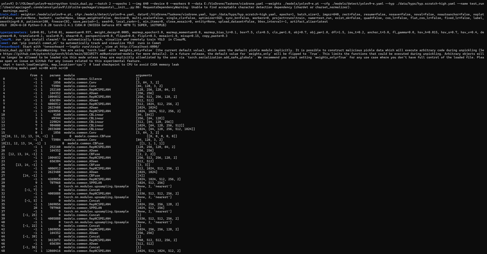
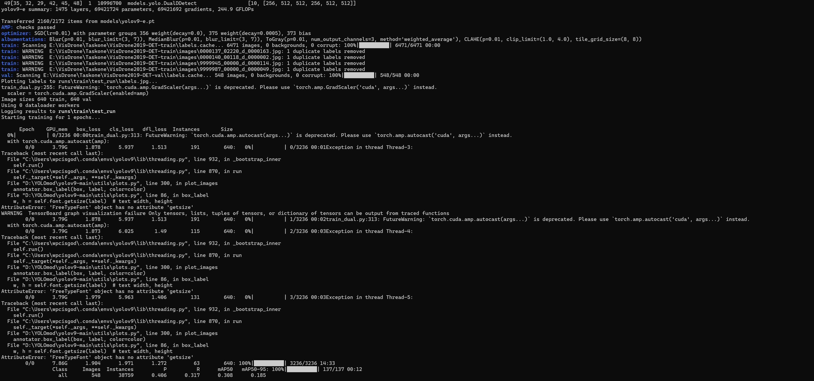
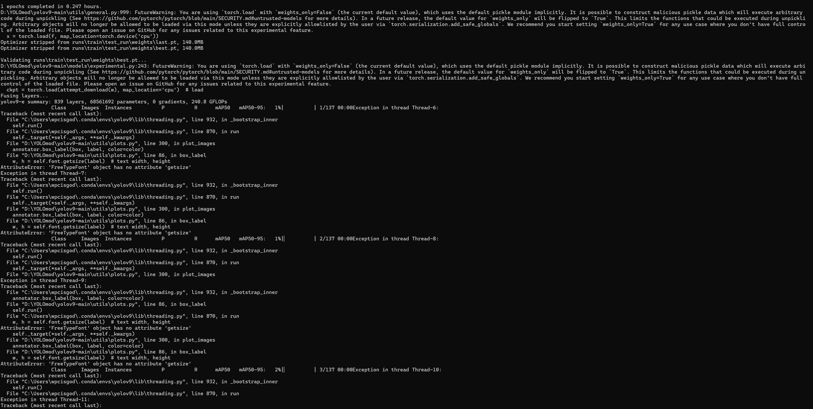
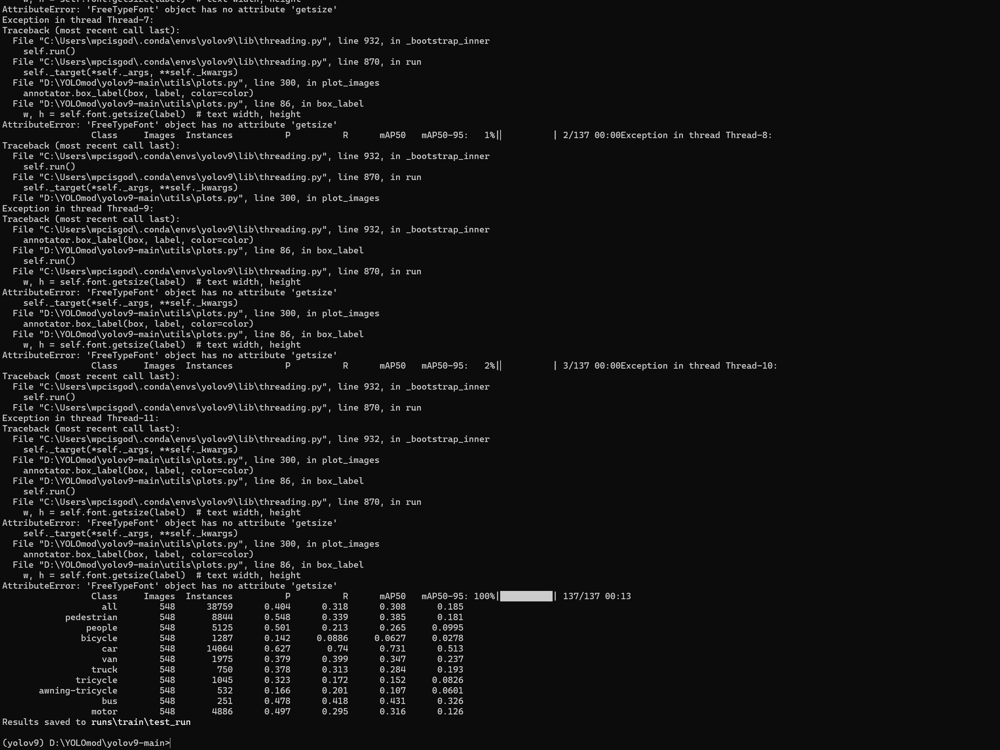
今天就到这里了，后面再详细的来研究这些，以及其报错。

### 六 报错修复与结果解读

- 修复`in box_label w, h = self.font.getsize(label)  # text width, height`和`AttributeError: 'FreeTypeFont' object has no attribute 'getsize'`，该问题是因为Pillow版本过高，需要更换版本。打开conda命令行，进入yolov9-main项目，启动yolov9环境，依次使用如下命令进行pillow版本替换：
```bash
    python -c "import PIL; print(PIL.__version__)"    # 检查现有的pillow版本
    pip uninstall pillow -y    # 卸载该版本pillow
    pip install pillow==9.5.0    # 安装指定版本
    python -c "import PIL; print(PIL.__version__)"    # 查看版本
```

再次运行模型代码：
```bash
python train_dual.py --batch 2 --epochs 1 --img 640 --device 0 --workers 0 --data E:/VisDrone/Taskone/visdrone.yaml --weights ./models/yolov9-e.pt --cfg ./models/detect/yolov9-e.yaml --hyp ./data/hyps/hyp.scratch-high.yaml --name test_run
```
本次运行后，除了一个警告信息外，没有其他的报错或故障，主程序运行时间16:10，运行结果如下：
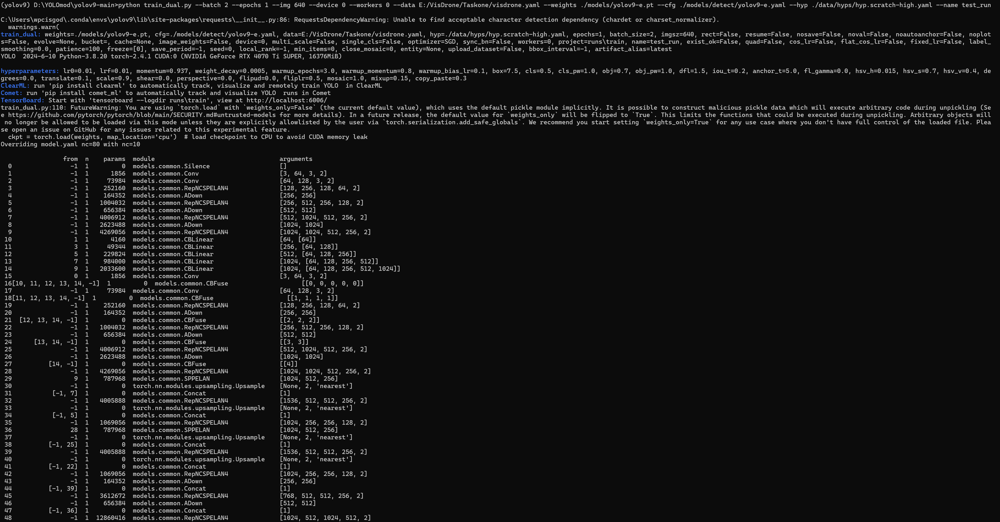
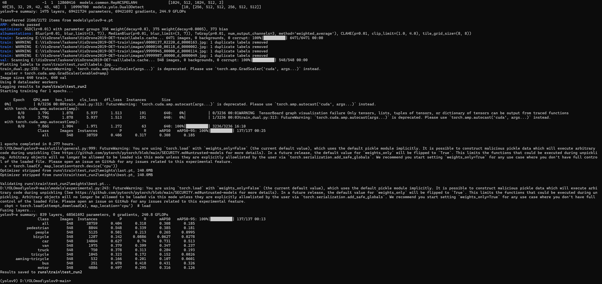

然后，查看一下如下警告信息
```
train_dual.py:255: FutureWarning: `torch.cuda.amp.GradScaler(args...)` is deprecated. Please use `torch.amp.GradScaler('cuda', args...)` instead.
scaler = torch.cuda.amp.GradScaler(enabled=amp)
```
此警告信息的意思是pytorch在未来可能弃用旧语法，建议使用新的语法，可以不用理睬。原因是pytorch在1.10版本以上时，引入了新的AMP（自动混合精度）API，yolov9使用的时旧版写法，这里提示让我们改。如果要改，方法是：将yolov9-main项目中的train_dual.py中第255行`scaler = torch.cuda.amp.GradScaler(enabled=amp)`改成`scaler = torch.amp.GradScaler('cuda', enabled=amp)`即可。

```
experimental.py:243: FutureWarning: You are using `torch.load` with `weights_only=False` (the current default value), which uses the default pickle module implicitly. It is possible to construct malicious pickle data which will execute arbitrary code during unpickling (See https://github.com/pytorch/pytorch/blob/main/SECURITY.md#untrusted-models for more details). In a future release, the default value for `weights_only` will be flipped to `True`. This limits the functions that could be executed during unpickling. Arbitrary objects will no longer be allowed to be loaded via this mode unless they are explicitly allowlisted by the user via `torch.serialization.add_safe_globals`. We recommend you start setting `weights_only=True` for any use case where you don't have full control of the loaded file. Please open an issue on GitHub for any issues related to this experimental feature.
```
这个也是pytorch的警告：PyTorch在加载模型权重（torch.load）时，默认允许加载任意的Python对象（通过 pickle），这在技术上存在潜在的安全风险（如果有人提供了恶意的权重文件）。为了增强安全性，PyTorch 在未来版本中将默认启用weights_only=True模式，只加载安全的张量数据，不执行任意代码。
YOLOv9 的代码中使用了 torch.load 但没有显式设置 weights_only，所以弹出了这个 FutureWarning，提醒开发者适配新版本。
如果想彻底消除警告，可以在YOLOv9的代码中找到所有torch.load调用的地方，加上`weights_only=False`参数（因为目前默认就是 False，加不加一样）。但这不是必须的，因为你的训练环境完全可控，权重文件都是自己下载或生成的，没有安全风险。

